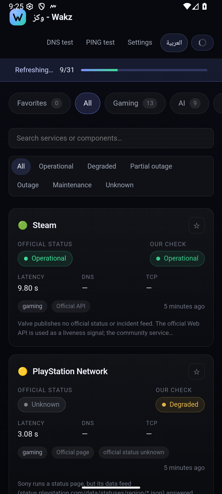

# Wakz — وكز

تطبيق لمتابعة حالة الخدمات والمنصّات الرقمية، مع أدوات قياس اتصال محلية.
Service status and connectivity information based on available data sources.



<sub>صورة حقيقية من الإصدار الحالي على جهاز أندرويد. المزيد من الصور ستُضاف إلى
`docs/screenshots/` لاحقًا.</sub>

---

# العربية

## نبذة

**وكز (Wakz)** تطبيق لمتابعة حالة الخدمات والمنصّات الرقمية: يعرض حالة كل خدمة، والحوادث والصيانة
عندما تكون متاحة من مصادر البيانات، إضافة إلى أدوات قياس اتصال (DNS وPing وزمن الاستجابة).

التطبيق **محلي أولًا (Local-First)**: المجمّع ومحرّك الحالة والكاش تعمل داخل جهاز المستخدم، ويتصل
التطبيق بمصادر الخدمات الرسمية مباشرة، ولا يُرسل أي قياس إلى خادم. ويمكن لمن يريد تشغيل خادم خاص
أن يكتب عنوانه في الإعدادات، وهو **اختياري** وليس شرطًا للتشغيل.

الحالات تُبنى على **المصادر المتاحة** مع استقصاء دوري (الكاش 7 دقائق)، لذلك لا يمكن وصفها بأنها
بثّ لحظي (Real-Time). كما يفصل التطبيق دائمًا بين:

* **الحالة الرسمية** — ما يعلنه مزوّد الخدمة.
* **فحص الاتصال** — ما تقيسه شبكتك أنت تجاه الخدمة.

لا يُحوَّل «غير معروف» إلى «تعمل»، ولا يُغيّر فحصنا الحالة الرسمية للمزوّد.

## المميزات

* حالات الخدمات والمنصّات الرقمية مع بيان المصدر الرسمي لكل حالة.
* حالات **الألعاب** والخدمات الرقمية (Steam، Epic، PlayStation، Xbox، Discord …).
* حالات خدمات **الذكاء الاصطناعي** (OpenAI، Claude، Gemini، Groq، Hugging Face …).
* **الخدمات السحابية والتقنية** (Cloudflare، GitHub، AWS، Azure، Google Cloud، Vercel …).
* خدمات **الإعلام والمنصّات الرقمية** (Twitch، Plex، Vimeo، خدمات آبل، TMDB، Trakt …).
* تصنيفا **الأعمال والمالية** و**التسوّق** (Notion، Figma، Zoom، Shopify، Etsy، Zalando …).
* **الخدمات المحلية المدعومة** (زد، سلة، تابي، بيتابس) وتظهر داخل السعودية فقط.
* **معلومات آخر تحديث** لكل خدمة ولكل قياس.
* **الصيانة القادمة** مع وقت البداية والانتهاء عند توفّرها في المصدر.
* **المفضلة**: تثبيت الخدمات لتظهر أولًا، مع إمكانية **تحديث المفضلة وحدها** لتسريع الجلب.
* بحث في الخدمات والمكوّنات، وفلترة حسب الحالة.
* دعم **العربية والإنجليزية**، واللغة الافتراضية تتبع نظام الجهاز.
* واجهة **متوافقة مع الجوال** مع تطبيق أندرويد جاهز.

## قياس الاتصال

كل القياسات تُجرى من **جهاز المستخدم وشبكته المحلية**، وقد تختلف من مستخدم لآخر حسب مزوّد
الإنترنت والموقع والشبكة المحلية وإعدادات DNS والمسار الشبكي وحالة الخدمة نفسها. ولهذا لا
تُعرض هذه القياسات على أنها «حالة عالمية» للخدمة.

| الأداة | ماذا تقيس | ملاحظات الدقة |
| --- | --- | --- |
| **قياس DNS** | زمن استجابة مزوّدي DNS العالميين عبر DNS المشفّر (DoH) مع العنوان الناتج، من الأسرع إلى الأبطأ | القياس من شبكتك، ويشمل المزوّدين: Cloudflare، Cloudflare Security، Google DNS، Quad9، AdGuard، NextDNS، DNS.SB |
| **قياس PING** | داخل تطبيق أندرويد: ICMP حقيقي عبر أمر النظام؛ وفي المتصفح: زمن استجابة HTTP مع توضيح ذلك | يعرض الأدنى/المتوسط/الأعلى ونسبة الفقد، ويذكر بوضوح طريقة القياس المستخدمة |
| **زمن استجابة الخدمة** | قياس HTTPS لكل خدمة ضمن «فحصنا» | منفصل تمامًا عن الحالة الرسمية |

إذا كان ICMP محجوبًا في الشبكة أو الجهاز، لا يُعتبر ذلك انقطاعًا للخدمة؛ يوضّح التطبيق السبب
وينتقل إلى قياس HTTP.

## الخدمات

| التصنيف | العدد |
| --- | --- |
| الألعاب | 13 |
| الذكاء الاصطناعي | 9 |
| السحابة والبنية التحتية | 20 |
| الوسائط | 9 |
| التواصل الاجتماعي | 7 |
| الأعمال والمالية | 7 |
| التسوّق | 5 |
| خدمات محلية (داخل السعودية) | 4 |

الإجمالي: **74 خدمة** قابلة للتجميع، إضافة إلى بطاقة «قريبًا» داخل تصنيف الخدمات المحلية.

كل خدمة موثّقة بمصدرها: النوع (Statuspage / status.io / Instatus / Better Stack / RSS / JSON
رسمي / XML رسمي) وهل هو رسمي وما إذا كان يحتاج مفتاحًا، في مستند
[docs/data-sources.md](docs/data-sources.md). ولا تُضاف أي خدمة بلا مصدر حقيقي يمكن التحقق منه:
الخدمات التي لا تنشر مصدر حالة مقروءًا آليًا تُعرض بحالة «غير معروف» مع فحوص الاتصال الخاصة
بالمستخدم، بوضوح تام.

## الخدمات القادمة

المشروع **مستمر في التطوير**، وتُضاف خدمات وتكاملات جديدة تدريجيًا بعد التحقق من وجود مصدر حالة
رسمي وموثوق. داخل تصنيف **الخدمات المحلية** توجد بطاقة **«قريبًا»** تشير إلى أن التصنيف المحلي
قيد التوسّع.

لا تُدرج أي خدمة على أنها قادمة إلا إذا كانت مخططة فعلًا، ولا تُضاف خدمة بمصدر غير حقيقي.

## اقتراحاتكم

يسعدنا استقبال اقتراحاتكم: **خدمات جديدة**، **منصّات جديدة**، **تحسينات**، أو **أفكار وميزات**.
الاقتراحات تساعد في تحديد أولويات الخدمات والتكاملات المستقبلية.

أرسل اقتراحك عبر صفحة **Issues** في مستودع المشروع على GitHub (زر Issues في أعلى الصفحة)، مع
ذكر اسم الخدمة والرابط الرسمي إن أمكن — وهذا يسرّع التحقق من وجود مصدر حالة.

## التثبيت

**أندرويد:**

* المتطلبات: أندرويد **7.0 (API 24)** أو أحدث.
* الاسم الظاهر: **وكز - Wakz** · معرّف الحزمة: `com.wakz.status`.
* ثبّت ملف `Wakz-1.4.1-ar.apk` (اسم الملف يتغيّر مع الإصدار)، ثم افتح التطبيق.
* عند أول تشغيل يتم تحديث كل الخدمات، وبعدها يعمل الكاش 7 دقائق.
* أداة القياس (DNS/Ping) تعمل من جهازك مباشرة.
* **وضع الخادم اختياري**: إن أردت ربط التطبيق بخادم خاص، أدخل العنوان يدويًا في الإعدادات أو استخدم
  زر **«اكتشاف الخادم تلقائيًا»** الذي يبحث عن خادم وكز في شبكتك المحلية (المنفذ 4310) ويتحقق منه.

ملف الـAPK يمكن بناؤه من المصدر بالخطوات التالية، أو تثبيته من قسم **Releases** في المستودع إن
تم إرفاقه.

## البناء

المتطلبات (مأخوذة من إعدادات المشروع نفسه):

* **Node.js 24** أو أحدث (يُشغَّل TypeScript مباشرة داخل Node).
* **JDK 21** لبناء تطبيق أندرويد (مثل JBR المرفق مع Android Studio).
* **Android SDK**: `compileSdk 36` و`build-tools 36.0.0` و`minSdk 24` و`targetSdk 36`.
* **Gradle 9.7.1** مع **Android Gradle Plugin 9.4.1**.

```bash
# 1) تثبيت الاعتماديات
npm install

# 2) بناء واجهة الويب + لقطة البيانات للعمل دون اتصال
npm run snapshot
npm run web:build

# 3) نسخ أصول الواجهة إلى مشروع أندرويد
npm run android:assets

# 4) بناء ملف APK (يتطلب Gradle وJAVA_HOME وANDROID_HOME)
npm run android:release
# الناتج: android/app/build/outputs/apk/release/app-release.apk
```

التحقق والاختبارات:

```bash
npm run typecheck   # فحص الأنواع
npm test            # 75 اختبارًا
npm run verify      # فحص الأنواع + الاختبارات + بناء الواجهة
```

الأوضاع الاختيارية (لا يحتاجها التطبيق للعمل محليًا):

```bash
npm run api         # خادم API + استضافة الواجهة (اختياري)
npm run collector   # مجمّع خلفي على خادم خاص (اختياري)
```

## الخصوصية

هذا القسم مكتوب بناءً على ما يفعله الكود فعليًا:

* **لا حسابات ولا تسجيل دخول**، ولا إعلانات، ولا أدوات تتبّع أو تحليلات، ولا تقارير أعطال.
* في **الوضع المحلي (الافتراضي)**: تُخزَّن الحالات والقياسات على جهازك فقط (IndexedDB)، ولا
  تُرسل إلى أي خادم.
* الطلبات الصادرة من التطبيق تقتصر على:
  1. **مصادر الحالة الرسمية** للخدمات المشمولة في التصنيفات.
  2. **مزوّدو DNS** الذين تختار قياسهم عند استخدام أداة قياس DNS.
  3. **العنوان الذي تكتبه** في أداة قياس Ping.
  4. **خدمة تحديد الدولة** (ipinfo.io، وعند تعذّرها ipwho.is) لتحديد ما إذا كان تبويب
     «خدمات محلية» يظهر لك — تُرسل هذه الخدمة عنوان IP العام فقط، وإن فشلت يرجع التطبيق إلى
     إعدادات الجهاز (المنطقة الزمنية واللغة).
* **الوضع الخادم اختياري تمامًا**: إن فعّلته تُرسل القياسات إلى الخادم الذي تحدّد عنوانه أنت فقط.
* لا توجد أي مفاتيح أو أسرار داخل التطبيق. المتغيّر الاختياري `RIOT_API_KEY` يخص وضع الخادم فقط،
  ويُقرأ من ملف `.env` غير المتتبَّع في Git.

## المساهمة

* **الاقتراحات والأفكار** تُرسل عبر Issues في المستودع (خدمات جديدة، تحسينات، ميزات).
* **المساهمة بالكود**: المشروع مُرخَّص للاستخدام الشخصي وغير التجاري فقط، لذلك لا تُقبل تعديلات
  الكود قبل اتفاق مسبق مع المالك.
* عند الإبلاغ عن مشكلة: اذكر الخدمة، والمصدر المتوقع، ولقطة شاشة إن أمكن.

## التوقيع

<a href="https://x.com/Hany_Sul">By Hany_Sul</a>

## الترخيص

المشروع متاح للاستخدام **الشخصي وغير التجاري** بموجب
[PolyForm Noncommercial License 1.0.0](LICENSE).

**غير مسموح** بالاستخدام التجاري، أو إعادة بيع البرنامج، أو تقديمه كخدمة مدفوعة، دون إذن كتابي
مسبق من صاحب الحقوق ([Hany_Sul](https://x.com/Hany_Sul)).

---

# English

## About

**Wakz (وكز)** is an app for following the status of digital services and platforms: it shows each
service's status plus incidents and maintenance whenever the data sources provide them, together
with local connectivity tools (DNS, ping and latency).

Wakz is **local-first**: the collector, the status engine and the cache run inside the user's
device, the app talks to the official service sources directly, and measurements are not sent to
any server. A self-hosted server is optional and can be configured in the app settings.

Status is built from the **available data sources** with periodic polling (a seven minute cache),
so it is not real-time. The app always separates:

* **Official status** — what the vendor publishes.
* **Our check** — what your own network measures towards the service.

An unknown vendor state is never turned into "operational", and our check never overrides the
vendor's status.

## Features

* Service and platform status with the official source for each status.
* **Gaming** and digital platforms (Steam, Epic, PlayStation, Xbox, Discord …).
* **AI** providers (OpenAI, Claude, Gemini, Groq, Hugging Face …).
* **Cloud and developer** services (Cloudflare, GitHub, AWS, Azure, Google Cloud, Vercel …).
* **Media and digital platforms** (Twitch, Plex, Vimeo, Apple services, TMDB, Trakt …).
* **Business & finance** and **Shopping** categories (Notion, Figma, Zoom, Shopify, Etsy, Zalando …).
* **Supported local services** (Zid, Salla, Tabby, PayTabs) shown inside Saudi Arabia only.
* **Last update** information for every service and every measurement.
* **Upcoming maintenance** with its start and end time when the source provides it.
* **Favorites**: pin services to the top and refresh the favorites list on its own.
* Search across services and components, and filtering by status.
* **Arabic and English**, with the interface following the device language by default.
* **Mobile-friendly** interface with a ready Android app.

## Connectivity Tools

All measurements are taken from the **user's device and local network**, so results differ between
users depending on the ISP, location, local network, DNS settings, network path and the service's
own state. They are never presented as a global service status.

| Tool | What it measures | Accuracy notes |
| --- | --- | --- |
| **DNS test** | Response time of global DNS providers over DNS-over-HTTPS, with the resolved address, fastest first | Measured from your network; covers Cloudflare, Cloudflare Security, Google DNS, Quad9, AdGuard, NextDNS, DNS.SB |
| **PING test** | Inside the Android app: real ICMP through the system ping; in a browser: HTTP round-trip time, clearly labelled | Shows min/average/max and loss, and states which method was used |
| **Service latency** | HTTPS latency for each service under "our check" | Completely separate from the official status |

If ICMP is blocked by the network or the device, that is not treated as an outage: the app explains
it and falls back to an HTTP measurement.

## Services

| Category | Count |
| --- | --- |
| Gaming | 13 |
| AI | 9 |
| Cloud & infrastructure | 20 |
| Media | 9 |
| Social | 7 |
| Business & finance | 7 |
| Shopping | 5 |
| Local services (inside Saudi Arabia) | 4 |

Total: **74 collectable services** plus one "coming soon" tile in the local services category.

Every service is documented with its source kind (Statuspage / status.io / Instatus / Better Stack /
official RSS / official JSON / official XML), whether it is official and whether it needs a key, in
[docs/data-sources.md](docs/data-sources.md). Services without a machine-readable official source
are shown as "unknown" together with the user's own connectivity checks, clearly labelled.

Screenshots captured from the current build live in [`docs/screenshots/`](docs/screenshots/).

## Coming Soon

The project is **under active development** and more services and integrations are added gradually
once a real, official status source has been verified. The **"coming soon"** tile inside the local
services category marks that this category is being expanded.

Nothing is listed as coming unless it is actually planned, and no service is added without a real
source.

## Suggestions

Suggestions are welcome: **new services**, **new platforms**, **improvements**, **ideas and
features**. Suggestions directly shape which services and integrations come next.

Please open an **issue** in this repository's **Issues** tab and include the service name and its
official link when possible — that speeds up verifying whether a status source exists.

## Installation

**Android:**

* Requires Android **7.0 (API 24)** or newer.
* Display name: **وكز - Wakz** · package: `com.wakz.status`.
* Install `Wakz-1.4.1-ar.apk` (the file name follows the release version) and open the app.
* The first launch refreshes the whole catalog; afterwards a seven minute cache is used.
* The measurement tools (DNS/PING) work directly from your device.
* **Server mode is optional**: to point the app at your own server, type the address in the settings
  screen or press **"Find my server automatically"**, which scans your local network for a Wakz
  server on port 4310 and verifies it.

The APK can be built from source with the steps below, or installed from the repository's
**Releases** section when an artifact is attached.

## Build

Requirements (taken from the project configuration):

* **Node.js 24** or newer (TypeScript runs directly in Node).
* **JDK 21** for the Android build (for example the JBR bundled with Android Studio).
* **Android SDK**: `compileSdk 36`, `build-tools 36.0.0`, `minSdk 24`, `targetSdk 36`.
* **Gradle 9.7.1** with **Android Gradle Plugin 9.4.1**.

```bash
# 1) dependencies
npm install

# 2) web interface + offline data snapshot
npm run snapshot
npm run web:build

# 3) copy the web assets into the Android project
npm run android:assets

# 4) build the APK (needs Gradle, JAVA_HOME and ANDROID_HOME)
npm run android:release
# output: android/app/build/outputs/apk/release/app-release.apk
```

Checks and tests:

```bash
npm run typecheck   # static type check
npm test            # 75 tests
npm run verify      # typecheck + tests + web build
```

Optional server mode (never required for the local app):

```bash
npm run api         # API server + serves the web build (optional)
npm run collector   # background collector for a self-hosted instance (optional)
```

## Privacy

This section reflects what the code actually does:

* **No accounts, no sign-in, no ads, no analytics or tracking, no crash reporting.**
* **Local mode (default):** status and measurements are stored on your device only (IndexedDB) and
  are not sent to any server.
* Outgoing requests are limited to:
  1. the **official status sources** of the services in the catalog;
  2. the **DNS providers** you choose to measure in the DNS tool;
  3. the **address you type** in the PING tool;
  4. a **country lookup** (ipinfo.io, falling back to ipwho.is) to decide whether the local
     services tab is shown to you — only the public IP address is sent, and if the lookup fails the
     app falls back to device settings (time zone and language).
* **Server mode is fully optional:** if enabled, measurements go only to the server address you
  configure.
* No secrets ship with the app. The optional `RIOT_API_KEY` belongs to server mode only and is read
  from a `.env` file that is not tracked by Git.

## Contributing

* **Suggestions and ideas:** open an issue (new services, improvements, features).
* **Code contributions:** the project is licensed for personal and noncommercial use only, so code
  changes are not accepted before an explicit agreement with the owner.
* When reporting a problem, include the service, the expected source and a screenshot if possible.

## Credits

<a href="https://x.com/Hany_Sul">By Hany_Sul</a>

## License

Wakz is source-available for **personal and other noncommercial use** under the
[PolyForm Noncommercial License 1.0.0](LICENSE).

**Commercial use, reselling the software, or offering it as a paid service is not permitted**
without a separate written license from the copyright holder ([Hany_Sul](https://x.com/Hany_Sul)).

---

<sub>Wakz was named “TechPulse” during early development, which is why some environment variables
and internal paths still use the `TECHPULSE_` prefix and the project folder is `Pro2`.</sub>
